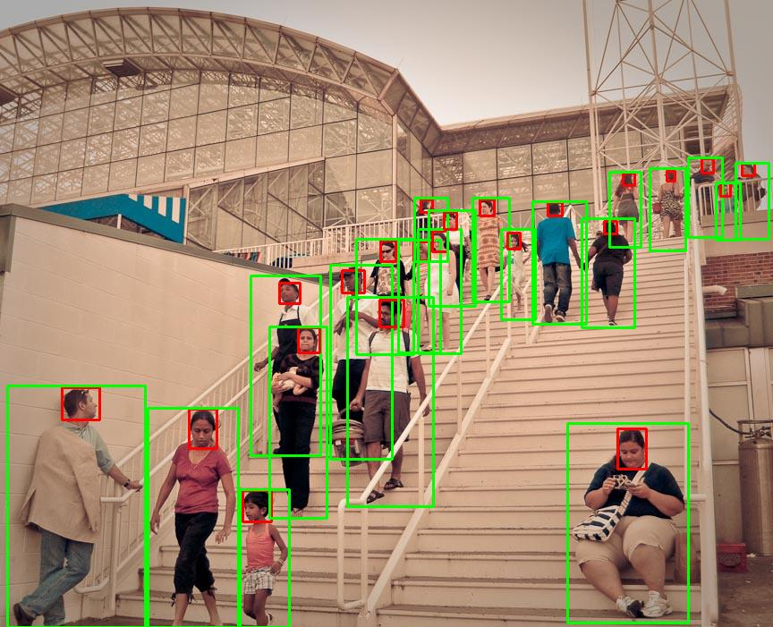

YOLOv4 CrowdHuman Tutorial
==========================

This is a tutorial on a YOLOv4 people detector using [Darknet](https://github.com/AlexeyAB/darknet) and the [CrowdHuman dataset](https://www.crowdhuman.org/).

NOTE: This is still a work in progress...

Table of contents
-----------------

* [Setup](#setup)
* [Preparing training data](#preparing)
* [Training on a local PC](#training-locally)
* [Training on Coogle Colab](#training-colab)
* [Testing the custom trained yolov4 model](#testing)
* [Deploying onto Jetson Nano](#deploying)

<a name="setup"></a>
Setup
-----

If you plan to run training locally, you need to have a x86_64 PC with a decent GPU.  Just for reference, I mainly test the code in this repository using a desktop PC with:

* NVIDIA GeForce RTX 2080 Ti
* Ubuntu 18.04.5 LTS (x86_64)
    - CUDA 10.2
    - cuDNN 8.0.1

Alternatively, you could run training on Google [Colab](https://colab.research.google.com/notebooks/intro.ipynb).

In both cases, you should first download and preprocess data locally by following the steps in the next section.  Make sure python3 "cv2" (opencv) module is installed properly on your local PC since the data preprocessing code would require it.

<a name="preparing"></a>
Preparing training data
-----------------------

Note that I use python3 exclusively in this tutorial (python2 might not work).

1. Clone this repository.

   ```shell
   $ cd ${HOME}/project
   $ git clone https://github.com/jkjung-avt/yolov4_crowdhuman
   ```

2. Run the "prepare_rawdata.sh" script in the "data/" subdirectory.  It would download CrowdHuman dataset files and unzip all train/val image files.  You could refer to [data/README.md](data/README.md) for more information about the dataset.

   ```shell
   $ cd ${HOME}/project/yolov4_crowdhuman/data
   $ ./prepare_rawdata.sh
   ```

   This step could take quite a while depending on your internet speed.  When it's done, all train/val image files would be located in "data/crowdhuman/" and the original annotation files, "annotation_train.odgt" and "annotation_val.odgt", would be in "data/raw/".

3. Convert the annotation files to YOLO txt format.  Please refer to the [How to train (to detect your custom objects)](https://github.com/AlexeyAB/darknet#how-to-train-to-detect-your-custom-objects) section of darknet/README.md for an understanding of YOLO txt files.

   ```shell
   $ python3 gen_txts.py
   ```

   The "gen_txts.py" script would output all necessary ".txt" files in the "data/crowdhuman/" subdirectory.  At this point, you have all custom files needed to train a YOLOv4 CrowdHuman detector.  (I have also created "verify_txts.py" script in order to verify the generated txt files.)

   In this tutorial, I'm training the YOLOv4 model to detect 2 classes of object: "head" (0) and "person" (1), where the "person" class corresponds to "full body" in the original CrowdHuman annotations.  Take a look at [data/crowdhuman.data](data/crowdhuman.data), [data/crowdhuman.names](data/crowdhuman.names), and [data/crowdhuman/](data/crowdhuman) to gain a better understanding of the data files we have prepared for the training.

   

<a name="training-locally"></a>
Training on a local PC
----------------------

1. Download and build Darknet code.  (TODO: make darknet as a submodule and automate the build process.)

   ```shell
   $ cd ${HOME}/project/yolov4_crowdhuman
   $ git clone https://github.com/AlexeyAB/darknet.git
   $ cd darknet
   $ vim Makefile  # edit Makefile with a editor of your own preference
   ```

   Modify the first few lines of the "Makefile" as follows.  Please refer to [How to compile on Linux (using make)](https://github.com/AlexeyAB/darknet#how-to-compile-on-linux-using-make) for more information about these settings.  Note that CUDA compute "75" is for RTX 2080 Ti and "61" for GTX 1080.  You might need to modify those based on what kind of GPU you are using.

   ```
   GPU=1
   CUDNN=1
   CUDNN_HALF=1
   OPENCV=1
   AVX=1
   OPENMP=1
   LIBSO=1
   ZED_CAMERA=0
   ZED_CAMERA_v2_8=0

   ......

   USE_CPP=0
   DEBUG=0

   ARCH= -gencode arch=compute_61,code=[sm_61,compute_61] \
         -gencode arch=compute_75,code=[sm_75,compute_75]

   ......
   ```

   Then do a `make` to build darknet.

   ```shell
   $ make
   ```

   When it is done, I would suggest to test the darknet executable with the `test` command as follows.

   ```shell
   $ wget https://github.com/AlexeyAB/darknet/releases/download/darknet_yolo_v3_optimal/yolov4.weights \
          -q --show-progress --no-clobber
   $ ./darknet detector test cfg/coco.data cfg/yolov4-416.cfg yolov4.weights \
                             ${HOME}/Pictures/dog.jpg
   ```

2. Copy over all files needed for training and download the pre-trained weights.

   ```shell
   $ cd ${HOME}/project/yolov4_crowdhuman
   $ ./prepare_training.sh
   ```

3. Train the model.  Please refer to [How to train with multi-GPU](https://github.com/AlexeyAB/darknet#how-to-train-with-multi-gpu) for how to fine-tune your training process.  For example, you could specify `-gpus 0,1,2,3` in order to use multiple GPUs to speed up training.

   ```shell
   $ cd ${HOME}/project/yolov4_crowdhuman/darknet
   $ ./darknet detector train data/crowdhuman.data cfg/yolov4-crowdhuman-608.cfg \
                              yolov4.conv.137 -map -gpu 0
   ```

   The training loss graph would be displayed since we have specified `-map`.   Training this "yolov4-crowdhuman-608" model takes more than 30 hours on my RTX 2080 Ti.  Still in progress...

<a name="training-colab"></a>
Training on Coogle Colab
------------------------

Te be updated......

<a name="testing"></a>
Testing the custom trained yolov4 model
---------------------------------------

Te be updated......


<a name="deploying"></a>
Deploying onto Jetson Nano
--------------------------

Te be updated......
